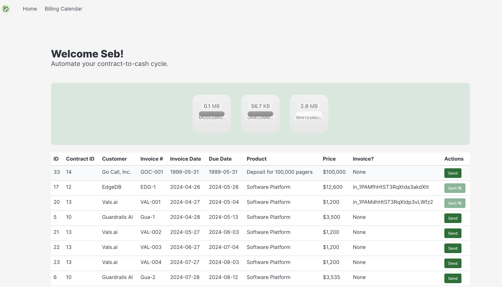

 

# Cashew Billing 
Extract billing schedules from contract data.

## Description
This project aims to extract billing schedules from contract data. It provides a solution for automating the process of extracting billing information from contracts, saving time and reducing errors.

## Installation
To use this project, follow these steps:
1. Clone the repository: `git clone https://github.com/your-username/billing.git`
2. Install the required dependencies: `pip install -r requirements.txt` and `npm install`
3. If you want to customize the UI you just need to modify `custom.scss` and run `npm run build-bulma`

## Usage
To run the project, use the following command:

# Demo
### Login

### Upload

### Send Bill

